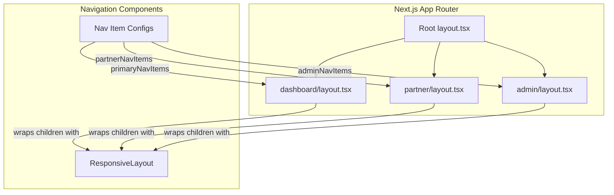

# Design Document: Comprehensive Navigation

## Overview

This feature integrates the existing `ResponsiveLayout` component into all role-based sections of the application (dashboard, partner, admin) via Next.js layout files. The goal is to eliminate dead-end pages by ensuring every page within a role section has persistent, role-appropriate navigation without requiring individual page components to reference the navigation shell.

The design leverages the existing `ResponsiveLayout` component which already handles responsive behavior (desktop top nav, mobile hamburger menu, mobile bottom nav), accessibility features (skip-to-content, aria-current, Escape key handling), and viewport constraints (no horizontal scroll from 320px–2560px).

Key design decisions:
- **Layout-level integration**: Navigation is injected via Next.js `layout.tsx` files at the route group level, not at individual page level.
- **Reuse existing component**: The `ResponsiveLayout` component is enhanced rather than replaced.
- **Role-based nav items**: Each role section receives its own set of nav items, exported from a shared location.
- **Admin layout preservation**: The existing admin auth gate is preserved; the navigation shell renders only after authorization succeeds.

## Architecture



### Route Structure

| Route Group | Layout File | Nav Items | Auth Gate |
|---|---|---|---|
| `/dashboard/*` | `src/app/dashboard/layout.tsx` (new) | `primaryNavItems` (5 items) | None (handled upstream) |
| `/partner/*` | `src/app/partner/layout.tsx` (new) | `partnerNavItems` (2 items) | None (handled upstream) |
| `/admin/*` | `src/app/admin/layout.tsx` (existing, modified) | `adminNavItems` (2 items) | Existing Supabase auth check preserved |
| `/auth/*` | No navigation shell | — | — |
| `/onboarding` | No navigation shell | — | — |

## Components and Interfaces

### Enhanced ResponsiveLayout

The existing `ResponsiveLayout` component requires the following enhancements:

1. **Focus trap in hamburger menu** (Requirement 6.5): When the mobile menu is open, Tab/Shift+Tab must cycle only through focusable elements inside the menu.
2. **Close on outside tap** (Requirement 1.6): Tapping outside the mobile menu area closes it.
3. **Unique aria-labels** (Requirement 6.7): Desktop nav and bottom nav must have distinct `aria-label` values.

```typescript
interface NavItem {
  href: string;
  label: string;
  icon: React.ReactNode;
}

interface ResponsiveLayoutProps {
  children: React.ReactNode;
  navItems?: NavItem[];
  headerContent?: React.ReactNode;
  showMobileNav?: boolean;
}
```

### New: Dashboard Layout (`src/app/dashboard/layout.tsx`)

```typescript
// Simple wrapper that renders ResponsiveLayout with primaryNavItems
export default function DashboardLayout({ children }: { children: React.ReactNode }) {
  return (
    <ResponsiveLayout navItems={primaryNavItems}>
      {children}
    </ResponsiveLayout>
  );
}
```

### New: Partner Layout (`src/app/partner/layout.tsx`)

```typescript
// Simple wrapper that renders ResponsiveLayout with partnerNavItems
export default function PartnerLayout({ children }: { children: React.ReactNode }) {
  return (
    <ResponsiveLayout navItems={partnerNavItems}>
      {children}
    </ResponsiveLayout>
  );
}
```

### Modified: Admin Layout (`src/app/admin/layout.tsx`)

The existing admin layout already has an auth gate. The modification wraps the authorized state's content with `ResponsiveLayout` using `adminNavItems`, while preserving the loading and unauthorized states without navigation.

```typescript
// New admin nav items export
export const adminNavItems: NavItem[] = [
  { href: '/admin', label: 'Users', icon: <UsersIcon /> },
  { href: '/admin/cycles', label: 'Cycles', icon: <CyclesIcon /> },
];
```

### Active Indicator Logic

The active indicator uses **longest prefix match** for the dashboard section (Requirement 1.2) and **exact match** for the partner section (Requirement 2.2):

```typescript
// Longest prefix match (dashboard)
function isActiveByPrefix(pathname: string, href: string): boolean {
  if (href === '/dashboard') return pathname === '/dashboard';
  return pathname.startsWith(href);
}

// Exact match (partner)
function isActiveByExact(pathname: string, href: string): boolean {
  return pathname === href;
}
```

The `ResponsiveLayout` component will accept an optional `activeMatchStrategy` prop:
- `'prefix'` (default): longest prefix match
- `'exact'`: exact pathname match

### Focus Trap Implementation

For the hamburger menu focus trap (Requirement 6.5):

```typescript
function useFocusTrap(containerRef: RefObject<HTMLElement>, isActive: boolean) {
  // When active:
  // 1. Query all focusable elements within container
  // 2. On Tab: move to next focusable, wrap to first at end
  // 3. On Shift+Tab: move to previous focusable, wrap to last at start
  // 4. On deactivation: return focus to trigger element
}
```

### Breadcrumb for Admin Nested Pages

For Requirement 3.2, a simple `BackLink` component renders on nested admin pages:

```typescript
interface BackLinkProps {
  href: string;
  label: string;
}

function BackLink({ href, label }: BackLinkProps) {
  return (
    <a href={href} className="...">
      ← {label}
    </a>
  );
}
```

This is rendered within the admin nested page components (e.g., `/admin/users/[id]/cycles/page.tsx`) rather than in the layout, since it's context-specific.

## Data Models

This feature does not introduce new data models or database changes. The navigation configuration is purely client-side:

### Navigation Configuration

```typescript
// src/components/layout/responsive-layout.tsx (existing file, extended)

export const primaryNavItems: NavItem[] = [
  { href: '/dashboard', label: 'Dashboard', icon: <HomeIcon /> },
  { href: '/dashboard/cycle', label: 'Cycle', icon: <CycleIcon /> },
  { href: '/dashboard/sharing', label: 'Sharing', icon: <ShareIcon /> },
  { href: '/dashboard/customize', label: 'Customize', icon: <SettingsIcon /> },
  { href: '/dashboard/date-request', label: 'Date Request', icon: <CalendarIcon /> },
];

export const partnerNavItems: NavItem[] = [
  { href: '/partner', label: 'Insights', icon: <HomeIcon /> },
  { href: '/partner/settings', label: 'Settings', icon: <SettingsIcon /> },
];

export const adminNavItems: NavItem[] = [
  { href: '/admin', label: 'Users', icon: <UsersIcon /> },
  { href: '/admin/cycles', label: 'Cycles', icon: <CyclesIcon /> },
];
```

### Active Match Strategy Type

```typescript
type ActiveMatchStrategy = 'prefix' | 'exact';
```

## Correctness Properties

*A property is a characteristic or behavior that should hold true across all valid executions of a system — essentially, a formal statement about what the system should do. Properties serve as the bridge between human-readable specifications and machine-verifiable correctness guarantees.*

### Property 1: Prefix match active indicator selects the longest matching nav item

*For any* URL pathname under `/dashboard` (or `/admin`) and any set of nav items with distinct href prefixes, the active indicator function SHALL return the nav item whose `href` is the longest prefix of the pathname, and exactly one item SHALL be marked active (via `aria-current="page"`).

**Validates: Requirements 1.2, 3.3, 6.2**

### Property 2: Exact match active indicator selects only the exactly matching nav item

*For any* URL pathname and any set of nav items, the exact match active indicator function SHALL mark a nav item as active (via `aria-current="page"`) if and only if the nav item's `href` is strictly equal to the pathname. If no nav item's href matches, no item SHALL be marked active.

**Validates: Requirements 2.2, 6.2**

### Property 3: Navigation configuration satisfies minimum link count per role section

*For any* role section configuration (dashboard, partner, admin), the nav items array SHALL contain at least the minimum required number of distinct links (2 for dashboard, 2 for partner, 1 for admin), and all links SHALL point to paths within the respective role section prefix.

**Validates: Requirements 5.1, 5.2, 5.3**

## Error Handling

### Navigation Shell Render Failure

If the `ResponsiveLayout` component fails to render (e.g., due to a JavaScript error), a React Error Boundary wrapping the navigation shell will catch the error and render a minimal fallback:

```typescript
// Fallback renders within 3 seconds (Requirement 5.5)
function NavigationFallback({ homeHref }: { homeHref: string }) {
  return (
    <div role="navigation" aria-label="Fallback navigation">
      <a href={homeHref}>Return to home</a>
    </div>
  );
}
```

### Auth Gate States (Admin)

The admin layout handles three states:
- **Loading**: Shows a loading indicator, no navigation shell rendered.
- **Unauthorized**: Shows an access denied message, no navigation shell rendered.
- **Authorized**: Renders the full navigation shell with admin nav items.

This prevents unauthorized users from seeing admin navigation structure.

### Invalid Routes (404)

For undefined routes within a role section, Next.js `not-found.tsx` files at the route group level will render a 404 page that still includes the navigation shell, ensuring users are never stuck without navigation.

## Testing Strategy

### Unit Tests (Example-Based)

Unit tests cover specific scenarios and edge cases:

- **Layout rendering**: Verify each layout file renders `ResponsiveLayout` with correct nav items
- **Responsive behavior**: Verify desktop nav visible at ≥768px, bottom nav visible at <768px
- **Hamburger menu**: Toggle open/close, Escape key closes, focus returns to button
- **Focus trap**: Tab cycles within open menu, Shift+Tab wraps correctly
- **Accessibility**: Skip-to-content link is first focusable, aria-expanded toggles, unique aria-labels on nav landmarks
- **Admin auth gate**: Navigation only renders in authorized state
- **404 pages**: Navigation shell present on not-found pages
- **Back link**: Nested admin pages show back link to parent

### Property-Based Tests (Universal Properties)

Property-based tests use `fast-check` to verify universal correctness across generated inputs:

- **Property 1**: Generate random dashboard/admin pathnames, verify prefix match selects correct nav item
- **Property 2**: Generate random partner pathnames, verify exact match behavior
- **Property 3**: Verify nav item configurations satisfy minimum link counts and section containment

**Configuration:**
- Library: `fast-check` (already in devDependencies)
- Test runner: `vitest` (already configured)
- Minimum iterations: 100 per property test
- Tag format: `Feature: comprehensive-navigation, Property {number}: {property_text}`

### Integration Tests

- Client-side navigation (no full page reload) when clicking nav items
- Route change closes mobile menu
- Admin auth flow end-to-end (mock Supabase)

