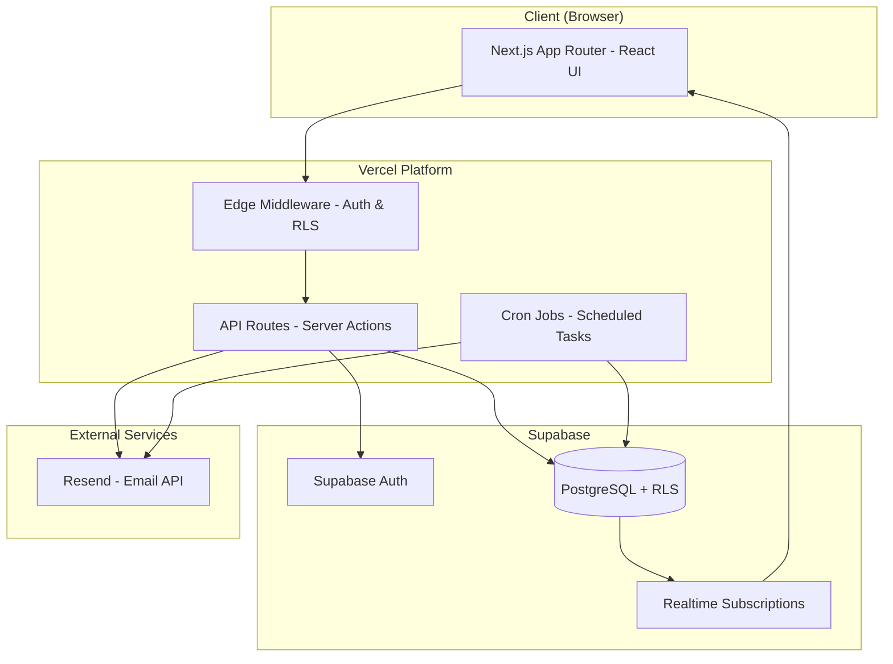
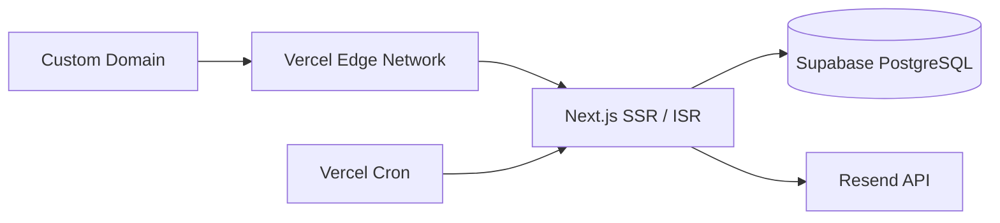
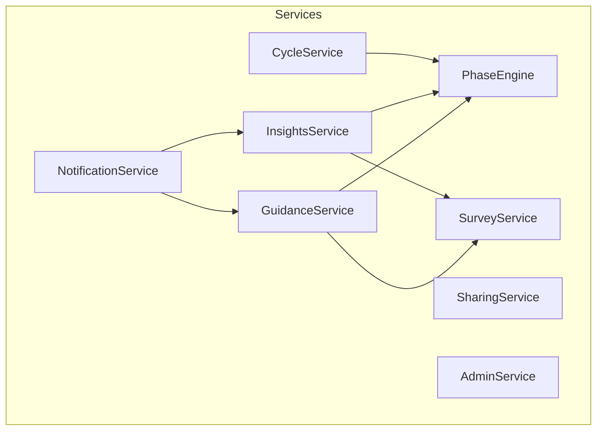
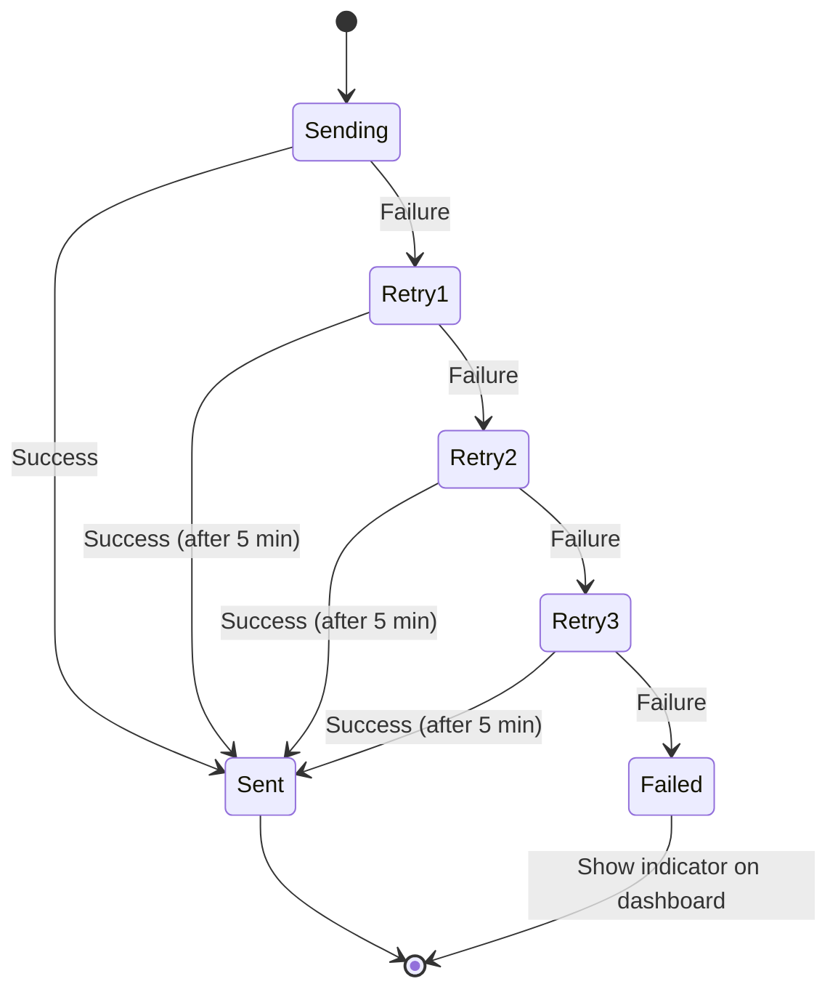

# Design Document: Know Your Woman Cycle

## Overview

Know Your Woman Cycle is a web application that helps a male partner understand and support a woman throughout her menstrual cycle. The system uses a paired account model where the Primary_User (woman) retains full data control and shares cycle insights with the Partner_User through a shared dashboard, email notifications, and contextual guidance.

The application calculates cycle phases from submitted start dates, generates phase-based insights (emotional tendencies, energy levels, behavioral patterns), and delivers actionable guidance to the partner. A personalization layer driven by an onboarding survey tailors all partner-facing content to the Primary_User's self-described patterns.

### Key Design Decisions

1. **Next.js 14 (App Router)** — Full-stack React framework providing SSR, API routes, and edge middleware in a single deployment unit. Chosen for developer productivity and performance on a greenfield project.
2. **PostgreSQL via Supabase** — Managed relational database with built-in auth, row-level security (RLS), and real-time subscriptions. Eliminates the need for a separate auth service and simplifies access control enforcement.
3. **Resend for email** — Modern transactional email API with good DX, template support, and delivery tracking. Handles notification emails, invite links, and date request emails.
4. **Vercel Cron Jobs** — Scheduled functions for daily summary regeneration, phase recalculation at midnight, and notification dispatch. Avoids the need for a separate job scheduler.
5. **Tailwind CSS + shadcn/ui** — Utility-first CSS with accessible, composable components. Meets WCAG 2.1 AA requirements out of the box and supports the responsive/mobile-first design requirements.
6. **Zod** — Runtime schema validation for all API inputs, ensuring type safety at the boundary between client and server.

---

## Architecture

### High-Level Architecture Diagram



### Request Flow

1. **Client** renders React components via Next.js App Router (server components by default, client components for interactivity).
2. **Edge Middleware** validates the session token on every request and attaches user context (role, linked partner ID, sharing permissions).
3. **API Routes / Server Actions** handle mutations and queries. All database access goes through Supabase client with RLS policies enforcing access control.
4. **Supabase Realtime** pushes updates to the Partner_User's dashboard when sharing permissions or cycle data change (meeting the 5-second update requirement).
5. **Cron Jobs** run at midnight (per-user timezone bucketed) to recalculate phases, regenerate daily summaries, and dispatch email notifications.

### Deployment Architecture



---

## Components and Interfaces

### Frontend Components

| Component | Description | Route |
|-----------|-------------|-------|
| `AuthPages` | Login, registration, invite acceptance | `/auth/*` |
| `OnboardingSurvey` | 6-question survey flow post-registration | `/onboarding` |
| `PrimaryDashboard` | Phase display, predictions, self-care insights | `/dashboard` |
| `PartnerDashboard` | Insights, daily summary, guidance panel | `/partner` |
| `CycleInput` | Date picker for cycle start dates | `/dashboard/cycle` |
| `PhaseCustomization` | Adjust phase durations, personal notes | `/dashboard/customize` |
| `SharingControls` | Toggle insight categories, notifications | `/dashboard/sharing` |
| `DateRequestForm` | Compose and send date requests | `/dashboard/date-request` |
| `NotificationSettings` | Partner notification frequency config | `/partner/settings` |
| `AdminPanel` | User management, cycle instances, annotations | `/admin/*` |

### API Routes (Server Actions)

| Endpoint | Method | Description |
|----------|--------|-------------|
| `/api/auth/register` | POST | Create Primary_User account |
| `/api/auth/invite` | POST | Generate Secure_Invite |
| `/api/auth/accept-invite` | POST | Accept invite, create Partner_User |
| `/api/cycle/start-date` | POST | Submit cycle start date |
| `/api/cycle/history` | GET | Retrieve cycle history |
| `/api/cycle/phase` | GET | Get current phase calculation |
| `/api/cycle/predictions` | GET | Get 60-day phase predictions |
| `/api/cycle/customize` | PUT | Update phase durations |
| `/api/cycle/notes` | POST/PUT | Add/update personal notes |
| `/api/sharing/categories` | PUT | Toggle insight categories |
| `/api/sharing/notifications` | PUT | Toggle notification types |
| `/api/sharing/revoke` | POST | Revoke all sharing |
| `/api/sharing/unlink` | POST | Unlink partner |
| `/api/partner/insights` | GET | Get shared insights for partner |
| `/api/partner/guidance` | GET | Get guidance panel content |
| `/api/partner/daily-summary` | GET | Get daily summary |
| `/api/partner/notifications` | PUT | Update notification preferences |
| `/api/partner/reminders` | PUT | Toggle/configure reminders |
| `/api/date-request` | POST | Submit date request |
| `/api/survey/submit` | POST | Submit onboarding survey |
| `/api/survey/update` | PUT | Update survey responses |
| `/api/admin/users` | GET | Search users |
| `/api/admin/users/:id` | GET/PUT/DELETE | Manage user account |
| `/api/admin/users/:id/suspend` | POST | Suspend account |
| `/api/admin/cycles/:userId` | GET | List cycle instances |
| `/api/admin/cycles/:id/annotate` | POST/PUT/DELETE | Manage annotations |
| `/api/admin/cycles/:id/override` | POST/PUT/DELETE | Manage overrides |

### Service Layer



| Service | Responsibility |
|---------|---------------|
| `CycleService` | CRUD for cycle records, conflict detection, history management |
| `PhaseEngine` | Phase calculation, prediction generation, duration scaling |
| `InsightsService` | Generate phase-based insights content, apply survey calibration |
| `GuidanceService` | Generate partner guidance, daily summaries, behavioral prompts |
| `NotificationService` | Email dispatch, scheduling, retry logic, delivery tracking |
| `SharingService` | Permission management, category toggles, real-time propagation |
| `SurveyService` | Survey storage, response calibration, guidance modifiers |
| `AdminService` | User search, suspension, annotation/override management |

---

## Data Models

### Entity Relationship Diagram

```mermaid
erDiagram
    USER {
        uuid id PK
        string email UK
        string password_hash
        enum role "primary | partner | admin"
        enum status "active | suspended | deleted"
        string suspension_reason
        timestamp created_at
        timestamp updated_at
    }

    PARTNER_LINK {
        uuid id PK
        uuid primary_user_id FK
        uuid partner_user_id FK
        enum status "active | revoked | unlinked"
        timestamp linked_at
        timestamp revoked_at
    }

    SECURE_INVITE {
        uuid id PK
        uuid primary_user_id FK
        string token UK
        timestamp expires_at
        enum status "pending | accepted | expired"
        timestamp created_at
    }

    CYCLE_RECORD {
        uuid id PK
        uuid primary_user_id FK
        date start_date
        int cycle_length_days
        timestamp created_at
    }

    PHASE_CUSTOMIZATION {
        uuid id PK
        uuid primary_user_id FK
        int menstrual_days "default 5"
        int follicular_days "default 8"
        int ovulation_days "default 1"
        int early_luteal_days "default 7"
        int late_luteal_days "default 7"
        timestamp updated_at
    }

    PERSONAL_NOTE {
        uuid id PK
        uuid primary_user_id FK
        enum phase "menstrual | follicular | ovulation | early_luteal | late_luteal"
        string content "max 500 chars"
        timestamp updated_at
    }

    SHARING_PREFERENCES {
        uuid id PK
        uuid primary_user_id FK
        boolean emotional_tendencies "default true"
        boolean behavioral_patterns "default true"
        boolean energy_levels "default true"
        boolean communication_guidance "default true"
        boolean daily_summaries "default true"
        boolean phase_alerts "default true"
        boolean partner_reminders "default true"
        boolean email_notifications_enabled "default true"
        timestamp updated_at
    }

    SURVEY_RESPONSE {
        uuid id PK
        uuid primary_user_id FK
        int question_number "1-6"
        string[] selected_options
        string free_text "nullable, max 200 chars"
        timestamp created_at
        timestamp updated_at
    }

    DAILY_SUMMARY {
        uuid id PK
        uuid primary_user_id FK
        date summary_date
        string todays_state "max 3 sentences"
        jsonb best_approach "1-3 items"
        jsonb avoid_this "1-3 items"
        enum phase_at_generation
        timestamp generated_at
    }

    DATE_REQUEST {
        uuid id PK
        uuid primary_user_id FK
        string location "nullable, max 200 chars"
        string mood "nullable, max 200 chars"
        date preferred_date "nullable"
        date window_start "nullable"
        date window_end "nullable"
        string personal_notes "nullable, max 500 chars"
        enum status "pending | sent | failed"
        timestamp created_at
    }

    NOTIFICATION_PREFERENCES {
        uuid id PK
        uuid partner_user_id FK
        enum frequency "daily | phase_based | custom"
        enum delivery_time "morning | evening"
        boolean reminders_enabled "default false"
        time reminder_time "default 09:00"
        string timezone
        timestamp updated_at
    }

    NOTIFICATION_LOG {
        uuid id PK
        uuid partner_user_id FK
        enum type "daily_summary | phase_alert | reminder | date_request"
        enum status "sent | failed | retrying"
        int retry_count "max 3"
        timestamp sent_at
        timestamp next_retry_at
    }

    ADMIN_ANNOTATION {
        uuid id PK
        uuid admin_user_id FK
        uuid cycle_record_id FK
        enum phase "nullable - null means cycle-level"
        string content "1-2000 chars"
        timestamp created_at
        timestamp updated_at
    }

    ADMIN_OVERRIDE {
        uuid id PK
        uuid admin_user_id FK
        uuid cycle_record_id FK
        enum phase
        string replacement_content "1-2000 chars"
        string original_content
        timestamp created_at
        timestamp updated_at
    }

    USER ||--o| PARTNER_LINK : "primary_user"
    USER ||--o| PARTNER_LINK : "partner_user"
    USER ||--o{ SECURE_INVITE : "creates"
    USER ||--o{ CYCLE_RECORD : "owns"
    USER ||--o| PHASE_CUSTOMIZATION : "configures"
    USER ||--o{ PERSONAL_NOTE : "writes"
    USER ||--o| SHARING_PREFERENCES : "sets"
    USER ||--o{ SURVEY_RESPONSE : "answers"
    USER ||--o{ DAILY_SUMMARY : "generated_for"
    USER ||--o{ DATE_REQUEST : "initiates"
    USER ||--o| NOTIFICATION_PREFERENCES : "configures"
    USER ||--o{ NOTIFICATION_LOG : "receives"
    CYCLE_RECORD ||--o{ ADMIN_ANNOTATION : "annotated_by"
    CYCLE_RECORD ||--o{ ADMIN_OVERRIDE : "overridden_by"
```



### Key Data Constraints

| Constraint | Enforcement |
|-----------|-------------|
| One partner per primary user | Unique constraint on `partner_link.primary_user_id` where status = 'active' |
| Invite expires in 72 hours | `expires_at = created_at + interval '72 hours'` |
| Cycle dates in past only | Check constraint: `start_date <= CURRENT_DATE` |
| Max 12 historical records | Application-level validation |
| Phase durations sum to cycle length | Application-level validation before save |
| Personal notes max 500 chars | Check constraint on `content` length |
| Survey: exactly 6 questions | Application-level validation |
| Notification retry max 3 | Check constraint: `retry_count <= 3` |

### Row-Level Security Policies

```sql
-- Primary users can only access their own cycle data
CREATE POLICY cycle_data_owner ON cycle_record
    FOR ALL USING (auth.uid() = primary_user_id);

-- Partners can read insights only when sharing is active
CREATE POLICY partner_read_insights ON daily_summary
    FOR SELECT USING (
        EXISTS (
            SELECT 1 FROM partner_link pl
            JOIN sharing_preferences sp ON sp.primary_user_id = pl.primary_user_id
            WHERE pl.partner_user_id = auth.uid()
            AND pl.status = 'active'
            AND sp.daily_summaries = true
        )
    );

-- Admin users have full read access
CREATE POLICY admin_full_access ON cycle_record
    FOR ALL USING (
        EXISTS (
            SELECT 1 FROM "user" WHERE id = auth.uid() AND role = 'admin'
        )
    );
```


---

## Correctness Properties

*A property is a characteristic or behavior that should hold true across all valid executions of a system — essentially, a formal statement about what the system should do. Properties serve as the bridge between human-readable specifications and machine-verifiable correctness guarantees.*

### Property 1: Password Validation Correctness

*For any* string, the password validator SHALL accept it if and only if it is between 8 and 128 characters long and contains at least one uppercase letter, one lowercase letter, and one digit. All other strings SHALL be rejected with a message indicating which requirements are not satisfied.

**Validates: Requirements 1.1, 1.7**

### Property 2: Secure Invite Expiry

*For any* generated Secure_Invite, the expiration timestamp SHALL equal the creation timestamp plus exactly 72 hours, and the token SHALL be unique across all invites in the system.

**Validates: Requirements 1.2**

### Property 3: One Active Partner Link Invariant

*For any* Primary_User, at most one Partner_Link with status 'active' SHALL exist at any point in time, regardless of the sequence of link/unlink operations performed.

**Validates: Requirements 1.5**

### Property 4: Cycle Data Access Control

*For any* user who is not the owning Primary_User, any attempt to create, update, or delete Cycle_Data SHALL be rejected. Only the Primary_User who owns the data SHALL have modification permissions.

**Validates: Requirements 2.1, 2.2**

### Property 5: Account Deletion Cascade

*For any* Primary_User account deletion, all associated Cycle_Records, Personal_Notes, Survey_Responses, Sharing_Preferences, Daily_Summaries, Date_Requests, and the linked Partner_User's access SHALL be removed, leaving zero orphaned records.

**Validates: Requirements 2.5, 5.8**

### Property 6: Unlink Preserves Primary Data

*For any* Primary_User who unlinks their Partner_User, all Primary_User data (Cycle_Records, Personal_Notes, Survey_Responses, Phase_Customizations) SHALL remain unchanged, while the Partner_User's access to Insights_Dashboard and Guidance_Panel SHALL be revoked.

**Validates: Requirements 2.6**

### Property 7: Independent Sharing Toggle

*For any* Sharing_Preferences configuration, toggling a single Insight_Category or notification type SHALL affect only that specific category/type and leave all other categories/types unchanged.

**Validates: Requirements 3.1, 3.3**

### Property 8: Sharing Category Round Trip

*For any* Insight_Category, disabling and then re-enabling it SHALL restore the Partner_User's view to the same content that was visible before the disable operation.

**Validates: Requirements 3.2**

### Property 9: Admin Search Result Limit

*For any* admin user search query against any size user database, the number of returned results SHALL never exceed 50.

**Validates: Requirements 5.2**

### Property 10: Primary Suspension Cascades to Partner

*For any* Primary_User account that has a linked Partner_User, suspending the Primary_User SHALL also revoke the Partner_User's access to the Insights_Dashboard and Guidance_Panel.

**Validates: Requirements 5.9**

### Property 11: Cycle Instance Ordering

*For any* set of Cycle_Instances belonging to a Primary_User, the admin display order SHALL be descending by start_date (most recent first).

**Validates: Requirements 6.1**

### Property 12: Admin Annotations Preserve Original Data

*For any* combination of Admin_Annotations and Admin_Overrides applied to a Cycle_Instance, the original user-provided Cycle_Data (start_date, cycle records) SHALL remain unmodified.

**Validates: Requirements 6.7**

### Property 13: Admin Override Revert Round Trip

*For any* Cycle_Phase with system-generated content, applying an override and then reverting it SHALL restore the original system-generated content exactly.

**Validates: Requirements 6.9**

### Property 14: Cycle Start Date Range Validation

*For any* date submitted as a cycle start date, the system SHALL accept it if and only if it falls within the range [today - 365 days, today]. All future dates and dates older than 365 days SHALL be rejected.

**Validates: Requirements 7.1, 7.4**

### Property 15: Historical Cycle Record Limit

*For any* Primary_User, the total number of historical cycle records SHALL never exceed 12.

**Validates: Requirements 7.3**

### Property 16: Cycle Overlap Conflict Detection

*For any* new cycle start date submitted by a Primary_User, if the date falls within the calculated duration of an existing cycle record (based on average cycle length or 28-day default), the system SHALL flag a conflict.

**Validates: Requirements 7.5**

### Property 17: Phase Calculation Correctness

*For any* valid cycle start date and number of elapsed days (1-28), the calculated Cycle_Phase SHALL match the standard phase boundaries: Menstrual (1-5), Follicular (6-13), Ovulation (14), Early Luteal (15-21), Late Luteal (22-28). When elapsed days exceed the cycle length, the phase SHALL be Late_Luteal with an overdue indicator.

**Validates: Requirements 8.1, 8.6**

### Property 18: Phase Duration Scaling Preserves Total

*For any* set of two or more historical cycle records, the proportionally scaled phase durations SHALL sum exactly to the calculated average cycle length.

**Validates: Requirements 8.2**

### Property 19: 60-Day Prediction Coverage

*For any* available Cycle_Data, the generated Phase_Predictions SHALL cover exactly 60 days from the current date, with no gaps or overlaps between predicted phases.

**Validates: Requirements 8.4**

### Property 20: Phase Duration Customization Validation

*For any* set of custom phase durations, the system SHALL accept them if and only if each individual duration is between 1 and 14 days AND the sum of all durations equals the Primary_User's total cycle length.

**Validates: Requirements 9.1, 9.2, 9.3**

### Property 21: Text Field Length Validation

*For any* text input to a length-constrained field (personal notes: 500 chars, location/mood: 200 chars, annotations/overrides: 1-2000 chars, suspension reason: 1-500 chars, behavioral prompts: 280 chars), the system SHALL accept the input if and only if its length falls within the specified bounds.

**Validates: Requirements 9.4, 11.2, 11.3, 11.5, 6.3, 6.5, 5.4**

### Property 22: Date Request Email Structure

*For any* Date_Request with a non-empty set of specified fields (location, mood, timing, personal notes), the formatted email SHALL contain a labeled section for each specified field and a phase-context section describing current Cycle_Phase tendencies.

**Validates: Requirements 11.7**

### Property 23: Phase Content Structure Completeness

*For any* of the five Cycle_Phases, the generated insights content SHALL contain: at least 3 emotional tendencies, at least 2 cognitive tendencies, at least 2 behavioral tendencies, an energy level indicator, and at least 2 communication tendencies. All five phases SHALL use the same set of content categories.

**Validates: Requirements 13.1, 13.2, 13.3, 13.5, 13.7**

### Property 24: Guidance Content Count Bounds

*For any* Cycle_Phase, the Guidance_Panel SHALL contain: 3-5 recommended supportive actions, 2-4 triggers to avoid, 2-4 communication strategies, and 2-4 discouraged language patterns.

**Validates: Requirements 14.1, 14.2, 14.3, 14.4**

### Property 25: Daily Summary Structure

*For any* generated Daily_Summary, the "Today's State" section SHALL contain the phase name and be no more than 3 sentences, the "Best Approach" section SHALL contain 1-3 items, and the "Avoid This" section SHALL contain 1-3 items.

**Validates: Requirements 15.1, 15.2, 15.3**

### Property 26: Decision Support Content Bounds

*For any* Cycle_Phase, the system SHALL generate 3-5 behavioral prompts (each max 280 characters and max 2 sentences) and 2-4 situational recommendations.

**Validates: Requirements 16.1, 16.2, 16.3**

### Property 27: Email Notification Content Structure

*For any* triggered Email_Notification, the email body SHALL contain: the current phase name with a summary of max 3 sentences, 1-3 emotional/behavioral insights, 1-3 "Do" recommendations, 1-3 "Don't" recommendations, and interaction guidance of max 2 sentences.

**Validates: Requirements 17.1, 17.2, 17.3, 17.4**

### Property 28: Notification Retry Logic

*For any* failed Email_Notification delivery, the system SHALL retry up to 3 times with 5-minute intervals between retries, and SHALL never exceed 3 retry attempts.

**Validates: Requirements 17.11**

### Property 29: Reminders Only During High-Energy Phases

*For any* day, partner reminders SHALL be sent if and only if the current Cycle_Phase is Ovulation_Phase or Follicular_Phase, the Partner_User has reminders enabled, AND the Primary_User has not disabled partner reminders via sharing controls.

**Validates: Requirements 18.1, 18.5, 18.6**

### Property 30: Reminder Rate Limit

*For any* Partner_User on any given day, at most one reminder notification SHALL be delivered, regardless of how many trigger conditions are met.

**Validates: Requirements 18.4**

### Property 31: Tone and Language Compliance

*For any* user-facing generated content (phase descriptions, guidance, daily summaries, email notifications), the text SHALL: (a) contain zero instances of deterministic language ("she will feel", "always", "never", "definitely", "certainly"), (b) include at least one probabilistic qualifier per statement about emotional state or behavior, (c) use second-person collaborative framing ("you might", "consider") rather than directive framing ("you must", "you need to"), and (d) include at least one individual variation acknowledgment per phase description.

**Validates: Requirements 19.1, 19.2, 19.3, 19.4, 19.5, 13.6, 14.5, 14.6**

### Property 32: Survey Selection Constraints

*For any* Onboarding_Survey submission, Questions 1, 2, 3, 5, and 6 SHALL have exactly one selected response, and Question 4 SHALL have one or more selected responses. Submissions violating these constraints SHALL be rejected.

**Validates: Requirements 20.8**

### Property 33: Survey Calibration Correctness

*For any* combination of Survey_Responses, the generated Partner_User guidance SHALL reflect the calibration rules: Q1 maps to confidence level, Q2 maps to emotional emphasis, Q3 maps to social energy recommendations, Q4 maps to avoidance triggers, Q5 maps to support style, and Q6 maps to communication approach.

**Validates: Requirements 20.10, 20.11, 20.12, 20.13, 20.14, 20.15, 20.16**

### Property 34: Survey Response Privacy

*For any* Partner_User-facing content (Insights_Dashboard, Guidance_Panel, Daily_Summary, Email_Notifications), the raw Survey_Response data (question text, selected option labels) SHALL never appear. Only calibrated guidance derived from the responses SHALL be visible.

**Validates: Requirements 20.20**

---

## Error Handling

### Error Categories and Strategies

| Category | Strategy | User Experience |
|----------|----------|----------------|
| **Validation Errors** | Return immediately with field-specific messages | Inline error messages next to invalid fields |
| **Authentication Errors** | Redirect to login, clear stale tokens | "Session expired, please log in again" |
| **Authorization Errors** | Return 403 with role-appropriate message | "You don't have permission to perform this action" |
| **Conflict Errors** | Return 409 with conflict details | Cycle overlap warning with conflicting record info |
| **Rate Limit Errors** | Return 429 with retry-after header | "Too many requests, please try again in X seconds" |
| **Email Delivery Failures** | Retry 3x with 5-min intervals, then mark failed | Undelivered indicator on dashboard |
| **Database Errors** | Log, return generic 500, alert ops | "Something went wrong. Please try again." |
| **Realtime Connection Loss** | Auto-reconnect with exponential backoff | Subtle "reconnecting..." indicator |

### Validation Error Responses

All API validation errors return a consistent shape:

```typescript
interface ValidationError {
  code: "VALIDATION_ERROR";
  fields: {
    [fieldName: string]: {
      message: string;
      constraint: string; // e.g., "min_length", "max_length", "pattern"
    };
  };
}
```

### Email Delivery Retry Flow



### Graceful Degradation

- **Supabase Realtime unavailable**: Fall back to polling every 30 seconds for dashboard updates
- **Email service unavailable**: Queue notifications for retry, show pending indicator
- **Phase calculation edge cases**: When cycle exceeds expected length, continue showing Late Luteal with "overdue" indicator rather than erroring

---

## Code Quality and Engineering Standards

### Project Structure

The codebase follows a predictable, modular directory structure with clear separation of concerns:

```
src/
├── app/                    # Next.js App Router (routes, layouts, pages)
│   ├── api/                # API route handlers (thin layer, delegates to services)
│   ├── auth/               # Auth pages (login, register, invite)
│   ├── dashboard/          # Primary_User dashboard pages
│   ├── partner/            # Partner_User dashboard pages
│   ├── admin/              # Admin panel pages
│   └── onboarding/         # Onboarding survey flow
├── components/             # Reusable React components
│   ├── ui/                 # shadcn/ui primitives
│   ├── forms/              # Form components (date picker, toggles, survey)
│   ├── dashboard/          # Dashboard-specific components
│   └── layout/             # Layout components (nav, sidebar, responsive shell)
├── services/               # Business logic (framework-agnostic)
│   ├── cycle-service.ts
│   ├── phase-engine.ts
│   ├── insights-service.ts
│   ├── guidance-service.ts
│   ├── notification-service.ts
│   ├── sharing-service.ts
│   ├── survey-service.ts
│   └── admin-service.ts
├── lib/                    # Shared utilities and configuration
│   ├── supabase/           # Supabase client setup (server/client/middleware)
│   ├── validation/         # Zod schemas and validation functions
│   ├── constants.ts        # Shared constants (phase durations, limits)
│   └── types.ts            # Shared TypeScript interfaces and enums
├── hooks/                  # Custom React hooks
└── middleware.ts           # Edge Middleware (auth, role routing)
```

### Coding Standards

| Standard | Tool | Configuration |
|----------|------|---------------|
| Linting | ESLint | `@typescript-eslint/strict` + Next.js recommended rules |
| Formatting | Prettier | 2-space indent, single quotes, trailing commas, 100 char line width |
| Type Safety | TypeScript | `strict: true`, no `any` in production code |
| Import Order | ESLint plugin | External → internal (`@/`) → relative |
| Pre-commit | Husky + lint-staged | Lint + format check on staged files |
| Coverage | vitest | Minimum 80% for `services/` and `lib/` directories |

### Architecture Principles

1. **Services are framework-agnostic** — All business logic lives in `services/` as pure TypeScript functions/classes with no dependency on Next.js, React, or Supabase internals. Database access is injected via typed interfaces.
2. **API routes are thin** — Route handlers validate input (Zod), call the appropriate service, and format the response. No business logic in route files.
3. **Components are presentational** — React components receive data via props or hooks. Data fetching happens in server components or dedicated hooks, not inside UI components.
4. **Explicit over implicit** — No magic. Service dependencies are passed explicitly. Data transformations are traceable through function calls.
5. **Single Responsibility** — Each file has one purpose. Services handle one domain. Components render one concern.

### Documentation Standards

- **README.md** — Setup instructions, architecture overview, environment variables, development workflows, deployment guide
- **JSDoc** — All exported service methods, utility functions, and complex algorithms
- **Inline comments** — Only where intent is non-obvious (business rules, workarounds, edge cases)
- **No redundant comments** — Code that is self-explanatory does not get comments restating what it does

### Dependency Management

- All dependencies pinned to exact versions in `package.json`
- Database schema changes managed exclusively through Supabase migrations (sequential, versioned SQL files)
- No direct imports of concrete service implementations in components; services accessed through typed interfaces for testability

---

## Testing Strategy

### Testing Approach

This feature uses a dual testing approach:

1. **Property-Based Tests** — Verify universal properties across randomized inputs using `fast-check` (TypeScript PBT library). Each property test runs a minimum of 100 iterations.
2. **Unit Tests** — Verify specific examples, edge cases, integration points, and error conditions using `vitest`.
3. **Integration Tests** — Verify end-to-end flows, timing requirements, and external service interactions using `vitest` + `@testing-library/react`.
4. **E2E Tests** — Verify critical user journeys using `Playwright`.

### Property-Based Testing Configuration

- **Library**: `fast-check` (npm package `fast-check`)
- **Runner**: `vitest`
- **Minimum iterations**: 100 per property
- **Tag format**: `// Feature: know-your-woman-cycle, Property {N}: {title}`

### Test Distribution

| Test Type | Coverage Focus | Count Estimate |
|-----------|---------------|----------------|
| Property tests | 34 correctness properties | ~34 test files |
| Unit tests | Edge cases, error paths, specific examples | ~50 tests |
| Integration tests | API flows, timing, email delivery | ~30 tests |
| E2E tests | Critical user journeys | ~10 tests |

### Key Testing Boundaries

- **PhaseEngine**: Pure computation — ideal for PBT (Properties 17, 18, 19)
- **Validation layer**: Pure functions — ideal for PBT (Properties 1, 14, 20, 21, 32)
- **Content generation**: Deterministic given inputs — ideal for PBT (Properties 23-27, 31)
- **Survey calibration**: Pure mapping logic — ideal for PBT (Property 33)
- **Access control**: RLS policies — tested via integration tests with role simulation
- **Email delivery**: External service — tested via mocks for retry logic (Property 28)
- **Realtime updates**: Timing-dependent — tested via integration tests

### Test File Structure

```
tests/
├── properties/           # Property-based tests (one per property)
│   ├── password-validation.test.ts
│   ├── phase-calculation.test.ts
│   ├── phase-scaling.test.ts
│   ├── prediction-coverage.test.ts
│   ├── content-structure.test.ts
│   ├── tone-compliance.test.ts
│   ├── survey-calibration.test.ts
│   └── ...
├── unit/                 # Example-based unit tests
│   ├── cycle-service.test.ts
│   ├── sharing-service.test.ts
│   ├── notification-service.test.ts
│   └── ...
├── integration/          # API and flow tests
│   ├── auth-flow.test.ts
│   ├── invite-flow.test.ts
│   ├── sharing-realtime.test.ts
│   └── ...
└── e2e/                  # End-to-end Playwright tests
    ├── onboarding.spec.ts
    ├── partner-dashboard.spec.ts
    └── admin-panel.spec.ts
```
